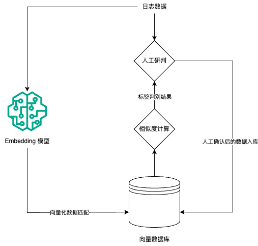

# 基于 Embedding 技术的攻击降噪
## 方案设计

### 整体流程

- 整体流程如下图所示
    
    <div align=center></div>
    
    1. 平台运营人员每日研判日志数据时，日志数据经过 Embedding 模型向量化后，与向量数据库中的数据进行相似度计算，返回最相似的数据标签作为判别结果
    2. 运营人员根据算法给出的标签，结合人工判断确认结果后，实现新数据入库
    3. 经过持续运营后实现大部分数据的自动打标，运营人员只需要关注置信度较低的灰事件

### 技术框架

- 提供基于 fastapi 的API
- Embedding 模型基于 BGE M3
    - 多功能：可以同时执⾏三种检索功能：单向量检索、多向量检索和稀疏检索
    - 多语⾔：⽀持100多种⼯作语⾔
    - 多粒度：它能够处理不同粒度的输⼊，从短句⼦到⻓达 8192 个词汇的⻓⽂档
- 向量数据库：Milvus

### 硬件需求

- Embedding 模型
    - 可以使用纯 CPU 环境，但是推理速度会变慢（建议在小数据量情况下使用）
    - GPU 计算能力为 7.0、7.5、8.0、8.6、8.9、9.0，可在 [NVIDIA 开发人员网站](https://developer.nvidia.com/cuda-gpus)上检查
- Milvus
    
    
    | 组件 | 要求 | 推荐配置 | 备注 |
    | --- | --- | --- | --- |
    | CPU | Intel 第二代 Core CPU 或更高 或 Apple Silicon | 单机部署: 8核或更多 或 集群部署: 16核或更多 | 当前版本的 Milvus 不支持 AMD CPU |
    | CPU 指令集 | SSE4.2 或 AVX 或 AVX2 或 AVX-512 | SSE4.2 或 AVX 或 AVX2 或 AVX-512 | Milvus 中的向量相似性搜索和索引构建需要 CPU 支持单指令多数据（SIMD）扩展集。请确保 CPU 支持列出的 SIMD 扩展集之一。有关更多信息，请参见https://en.wikipedia.org/wiki/Advanced_Vector_Extensions#CPUs_with_AVX 。 |
    | RAM | 集群部署: 64G 或 单机部署: 32G | 单机部署: 16G 或 集群部署: 128G | RAM 的大小取决于数据量 |
    | 硬盘 | SATA 3.0 SSD 或更高 | NVMe SSD 或更高 | 硬盘大小取决于数据量 |
    

## 开发过程

### 开发环境配置

#### 向量数据库

- Start Milvus.
    
    ```bash
    wget https://raw.githubusercontent.com/milvus-io/milvus/master/scripts/standalone_embed.sh
    bash standalone_embed.sh start
    ```
    
- Connect to Milvus
- Stop Milvus
    - To stop Milvus standalone, run:
        
        ```bash
        bash standalone_embed.sh stop
        ```
        
    - To delete data after stopping Milvus, run:
        
        ```bash
        bash standalone_embed.sh delete
        ```
        

#### SDK

- Python
    
    ```bash
    python3 -m pip install pymilvus==2.4.1
    ```
    

#### 数据库设计

- Collection
    - Command
    - URL
    - Payload
- Schema
    - id - 主键
    - string - 原始字符串
    - vector - 对应的向量
    - account - 研判人员
    - label - 研判标签
    - time - 入库时间

#### API

- Embedding 接口
    - 路由：`POST /embeddings`
    - 数据格式
        - 请求数据
            
            ```json
            {
            	"strings": [
            		"/authenticationService/appserver.do",
            		"/WebService/Newcapec.eCard.PlatFormWS.asmx",
            		"/tmp/flink-web-d9a47fd7-2447-4cde-95c8-e44dca9cb344/flink-web-upload/b33605e9-c144-46d9-aafc-45d0294d014f"
            	]
            }
            ```
            
        - 回复数据
            
            ```json
            {
            	"vectors": [
            		[-0.02505937, -0.00142193,  0.04015467, ..., -0.02094924, 0.02623661,  0.00324098], 
            		[ 0.00118463,  0.00649292, -0.00735763, ..., -0.01446293, 0.04243685, -0.01794822], 
            		[ 0.00415287, -0.0101492 ,  0.0009811 , ..., -0.02559666, 0.08084674,  0.00141647]
            	]
            }
            ```
            
    - 测试命令
        
        ```bash
        curl -X 'POST' \
          'http://localhost:8000/embeddings' \
          -H 'accept: application/json' \
          -H 'Content-Type: application/json' \
          -d '{
          "strings": [
            "/authenticationService/appserver.do",
            "/WebService/Newcapec.eCard.PlatFormWS.asmx",
            "/tmp/flink-web-d9a47fd7-2447-4cde-95c8-e44dca9cb344/flink-web-upload/b33605e9-c144-46d9-aafc-45d0294d014f"
          ]
        }'
        ```
        
- 增加数据接口
    - 路由：`POST /insert`
    - 数据格式
        - 请求数据
            
            ```bash
            {
            	"type": "url",
            	"id": 0,
            	"string": "/authenticationService/appserver.do",
            	"account": "admin",
            	"label": "malicious"
            }
            ```
            
        - 回复数据
            
            ```bash
            {
            	"ids": 0
            }
            ```
            
    - 测试命令
        
        ```bash
        curl -X 'POST' \
          'http://localhost:8000/insert' \
          -H 'accept: application/json' \
          -H 'Content-Type: application/json' \
          -d '{
        	"type": "url",
        	"id": 0,
        	"string": "/authenticationService/appserver.do",
        	"account": "admin",
        	"label": "malicious"
        }'
        ```
        
- 查询数据接口
    - 路由： `POST /search`
    - 数据格式
        - 请求数据
            
            ```bash
            {
            	"type": "url",
            	"limit": 2,
            	"strings": [
            		"/authenticationService/appserver.do",
            		"/WebService/Newcapec.eCard.PlatFormWS.asmx",
            		"/tmp/flink-web-d9a47fd7-2447-4cde-95c8-e44dca9cb344/flink-web-upload/b33605e9-c144-46d9-aafc-45d0294d014f"
            	]
            }
            ```
            
        - 回复数据
            
            ```bash
            [
            	[
            		{
            			"id": 0,
            			"distance": 0.9999999403953552,
            			"entity": {
            				"account": "admin",
            				"label": "malicious",
            				"time": 1716271109,
            				"id": 0,
            				"string": "/authenticationService/appserver.do"
            			}
            		},
            		{
            			"id": 1,
            			"distance": 0.5963093042373657,
            			"entity": {
            				"account": "admin",
            				"label": "benign",
            				"time": 1716271218,
            				"id": 1,
            				"string": "/WebService/Newcapec.eCard.PlatFormWS.asmx"
            			}
            		}
            	],
            	[
            		{
            			"id": 1,
            			"distance": 1.0000001192092896,
            			"entity": {
            				"account": "admin",
            				"label": "benign",
            				"time": 1716271218,
            				"id": 1,
            				"string": "/WebService/Newcapec.eCard.PlatFormWS.asmx"
            			}
            		},
            		{
            			"id": 0,
            			"distance": 0.5963093042373657,
            			"entity": {
            				"account": "admin",
            				"label": "malicious",
            				"time": 1716271109,
            				"id": 0,
            				"string": "/authenticationService/appserver.do"
            			}
            		}
            	],
            	[
            		{
            			"id": 2,
            			"distance": 1.0000001192092896,
            			"entity": {
            				"account": "admin",
            				"label": "benign",
            				"time": 1716271273,
            				"id": 2,
            				"string": "/tmp/flink-web-d9a47fd7-2447-4cde-95c8-e44dca9cb344/flink-web-upload/b33605e9-c144-46d9-aafc-45d0294d014f"
            			}
            		},
            		{
            			"id": 1,
            			"distance": 0.5284838080406189,
            			"entity": {
            				"account": "admin",
            				"label": "benign",
            				"time": 1716271218,
            				"id": 1,
            				"string": "/WebService/Newcapec.eCard.PlatFormWS.asmx"
            			}
            		}
            	]
            ]
            ```
            
    - 测试命令
        
        ```bash
        curl -X 'POST' \
          'http://localhost:8000/search' \
          -H 'accept: application/json' \
          -H 'Content-Type: application/json' \
          -d '{
        	"type": "url",
        	"limit": 2,
        	"strings": [
        		"/authenticationService/appserver.do",
        		"/WebService/Newcapec.eCard.PlatFormWS.asmx",
        		"/tmp/flink-web-d9a47fd7-2447-4cde-95c8-e44dca9cb344/flink-web-upload/b33605e9-c144-46d9-aafc-45d0294d014f"
        	]
        }'
        ```
        
- 修改数据接口
    - 路由：`POST /upsert`
    - 数据格式
        - 请求数据
            
            ```bash
            {
            	"type": "url",
            	"id": 0,
            	"string": "/authenticationService/appserver.do",
            	"account": "test",
            	"label": "malicious"
            }
            ```
            
        - 回复数据
            
            ```bash
            {
            	"upsert_count": 1
            }
            ```
            
    - 测试命令
        
        ```bash
        curl -X 'POST' \
          'http://localhost:8000/upsert' \
          -H 'accept: application/json' \
          -H 'Content-Type: application/json' \
          -d '{
        	"type": "url",
        	"id": 0,
        	"string": "/authenticationService/appserver.do",
        	"account": "test",
        	"label": "malicious"
        }'
        ```
        
- 删除数据接口
    - 路由：`POST /delete`
    - 数据格式
        - 请求数据
            
            ```bash
            {
            	"type": "url",
            	"ids": [1, 2]
            }
            ```
            
        - 回复数据
            
            ```bash
            {
                "delete_cnt": 2
            }
            ```
            
    - 测试命令
        
        ```bash
        curl -X 'POST' \
          'http://localhost:8000/delete' \
          -H 'accept: application/json' \
          -H 'Content-Type: application/json' \
          -d '{
        	"type": "url",
        	"ids": [1, 2]
        }'
        ```

#### 启动命令
```bash
uvicorn api:app --reload --host 0.0.0.0 --port 8000
```
